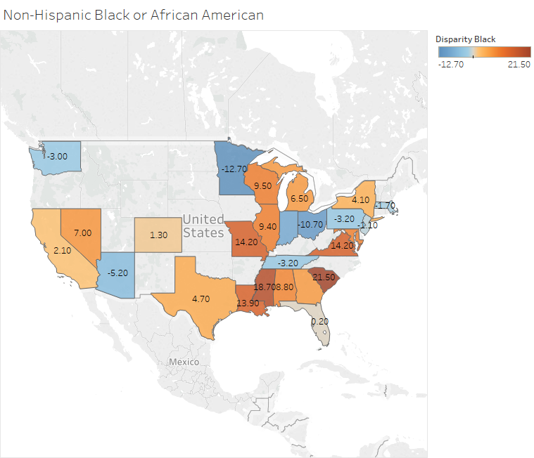
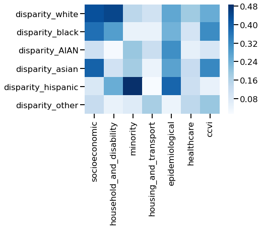

# Question: Which socioeconomic factors contribute most to racial disparities in morbidity from COVID-19?

# Data: 
Please see the [Data Folder](https://github.com/kmussar/covid19_datathon/tree/master/data) for details on our data sources. 

# Metrics:
We created a new metric to evaluate the racial disparity of COVID-19 mortality. We have coined this a 'disparity score', which is calculated as follows:
> Disparity Score of a given race = % COVID-19 deaths of that race - % population of that race

# Investigating Racial Disparities at the state-level:
## Datasets: 
 * COVID-19 cases by race as reported by the CDC 
 * Community-level vulnerability scores from the Surgo Foundation (grouped by state). 

## Notebooks: 
 * ['KM_covid19_state_level_deaths_and_ccvi.ipynb'](https://github.com/kmussar/covid19_datathon/blob/master/eda/KM_covid19_state_level_deaths_and_ccvi.ipynb)

First, we calculated the disparity score for each race. (Disparity Score of a given race = % COVID-19 deaths of that race - % population of that race). We visualized these scores on a map for each race of the following.  
* Black
* Asian
* Hispanic
* American Indian or Alaska Native 
* White 
* Other 
You can see each of these maps on Tableau here: [Tableau maps](https://public.tableau.com/profile/kristin.mussar#!/vizhome/maps_of_disparity_state/White) 

An example of one such map is shown below. This map shows the disparity scores for each state for Black patients. A higher score indicates that there are more COVID-19 deaths in the Black population of that state than the population of Black people in the state. As an example, South Carolina's population is 30% Black, yet 54% of their COVID-19 deaths are in Black patients.  

For more information on how this map was created please see the following notebook: ['KM_covid19_state_level_deaths_and_ccvi.ipynb'](https://github.com/kmussar/covid19_datathon/blob/master/eda/KM_covid19_state_level_deaths_and_ccvi.ipynb)

Next, we wanted to evaluate what factors were contributing to these disparities. We looked at the CCVI indiexes per state as a way of distinguishing, very broadly speaking, what the differences were in states with high disparity compared to low disparity. We joined the CCVI indexes to the CDC data by state abbreviation and then calculated a correlation matrix between the CCVI indexes and disparity scores for each race. This is represented below as a heatmap, with darker blue indicating factors that more strongly correlate with disparity. 

If we look at one group, Black patients (second row), we can see that the disparity scores correlate most highly with socieoeconomic factors. But another group, hispanic patients,correlates most strongly with minority factors. Due to these differences, solutions for minority groups impacted by COVID will likely be different. For black communities, focusing on affordable healthcare and education may be helpful, but for hispanics, perhaps access to translators would be more beneficial. 

# Investigating racial disparities at the county-level:  
**Notebook: 'KM_merge_datasets_county_level_demographics_and_covid_deaths.ipynb'**
1. Load datasets: 
  * Detailed demographic data from Johns Hopkins University
  * COVID-19 deaths from The New York Times. Group the number of deaths by FIPS code. 
  * Community-level vulnerability scores from The Surgo Foundation 
2. Join the three datasets, join on FIPS code. 
**Resulting csv 'county_detailed_demographics_and_deaths.csv'**

## Case Study - South Carolina and Tennessee
* Notebook: ['KM_SouthCarolina_Tennessee.ipynb'](https://github.com/kmussar/covid19_datathon/blob/master/eda/KM_SouthCarolina_Tennessee.ipynb)
* Data: county_detailed_demographics_and_deaths.csv 
As an aside, although we did not spend much time with this analysis approach, it is worth noting we also investigated a pair of states to try to uncover the underlying causes of racial disparities in COVID-19 outcomes. We chose to more closely evaluate two states with comparable Black populations, but different representation in COVID-19 deaths. These states are South Carolina and Tennessee. Approximately 30% of both South Carolina and Tennessee's populations are Black. In Tennesse, about 30% of deaths due to COVID are in Black patients. However, in South Carolina, this rises to a disproportionate 53%. 

The dataset that I used was the county-level detailed demographic dataset from JHU with COVID-19 deaths merged in. I filtered this data to create two new dataframes, one for each state. I then calculated the correlation scores between each demographic factor and COVID-19 deaths. Comparing the factors with the highest correlations between the two states, it became apparent that [infant mortality is an issue in Tennessee](https://ccf.georgetown.edu/2018/11/14/new-policy-brief-asks-why-are-tennessee-moms-and-babies-dying-at-such-a-high-rate/). This was insightful, but ultimately we decided that comparing one state to another was not the best approach for this analysis. (There are too many differences between states that cannot be controlled for). 
