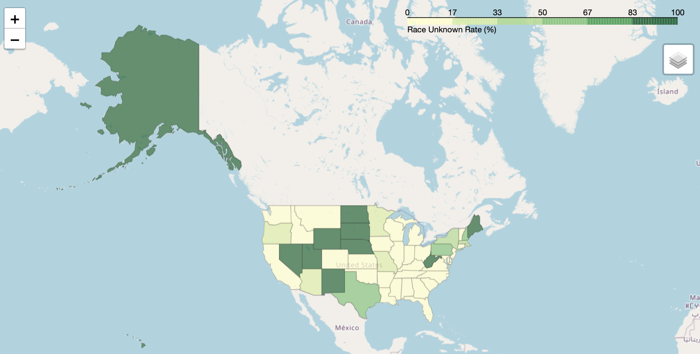
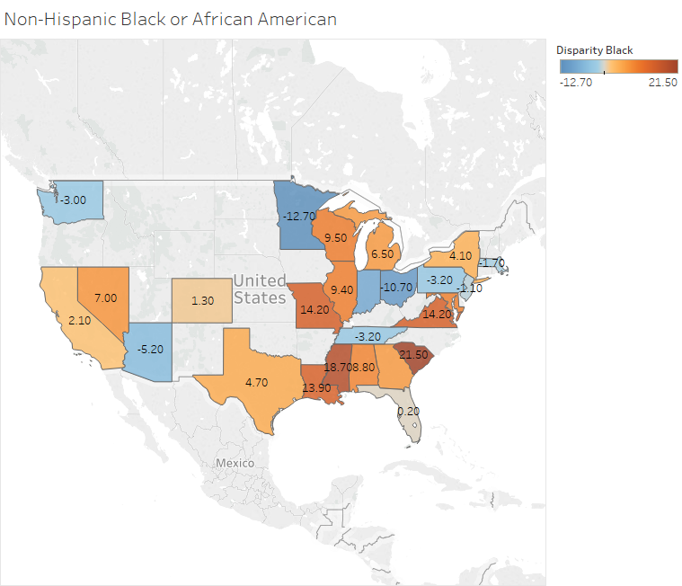

# Covid data coverage by state
Unfortunately the data available for COVID cases and deaths by race is incomplete. At the time of data collection, in early May, only 40 states were reporting data on race. Upon futher inspection, it appears that several states are reporting increidbly high percentages (>80%) of cases as 'unknown' race.  This indicates that even though the states are technically reporting cases by race, we are missing a lot of information. The following graph indicates the percentage of cases shown as 'unknown' race. Darker green indicates a higher percentage of cases. 

For more information on how this image was generated please see the following notebook: ['eda_race_coverage_map.ipynb'](https://github.com/kmussar/covid19_datathon/blob/master/eda/eda_race_coverage_map.ipynb)

# Covid disparities by Race
Using the information that is available, we investigated the disparity of COVID-19 deaths by race. We defined the disparity score as the % COVID-19 deaths - % state's population for each race. 

Please see the following [Tableau maps](https://public.tableau.com/profile/kristin.mussar#!/vizhome/maps_of_disparity_state/White) for a visualization of disparity scores per state per race. We have created a map for each of the following races:  
* Black
* Asian
* Hispanic
* American Indian or Alaska Native 
* White 
* Other 

An example map is shown below. This map shows the disparity scores for each state for Black patients. A higher score indicates that there are more COVID-19 deaths in the Black population of that state than the population of Black people in the state. As an example, South Carolina's population is 30% Black, yet 54% of their COVID-19 deaths are in Black patients.  

For more information on how this map was created please see the following notebook: ['KM_covid19_state_level_deaths_and_ccvi.ipynb'](https://github.com/kmussar/covid19_datathon/blob/master/eda/KM_covid19_state_level_deaths_and_ccvi.ipynb)

**Data Source:**
Data was collected and normalized by the CDC. It was downloaded on May 13, 2020 from: https://www.cdc.gov/nchs/nvss/vsrr/covid_weekly/index.htm

Importantly, the percentage of racial/ethnic groups per state population that is reported has been weighted. These weights ensure that the population estimates and percentage of COVID deaths represent comparable geographic areas. To see more details on how the weighted percentages were calculated, please visit: https://www.cdc.gov/nchs/nvss/vsrr/covid19/tech_notes.htm. For details on how each race is defined, please see the CDC notes referenced above. 

